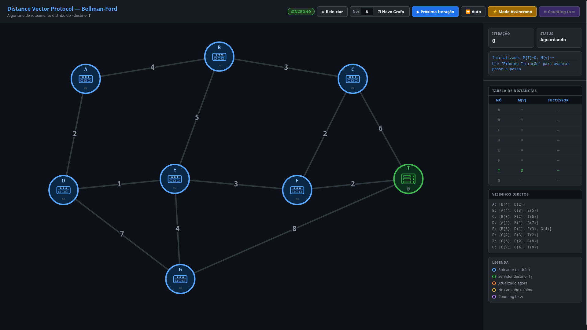
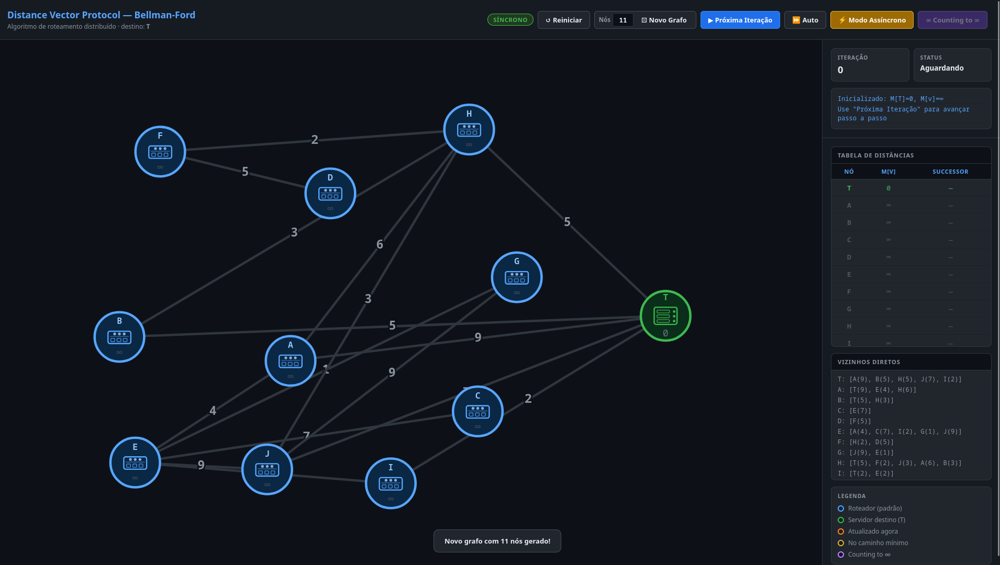
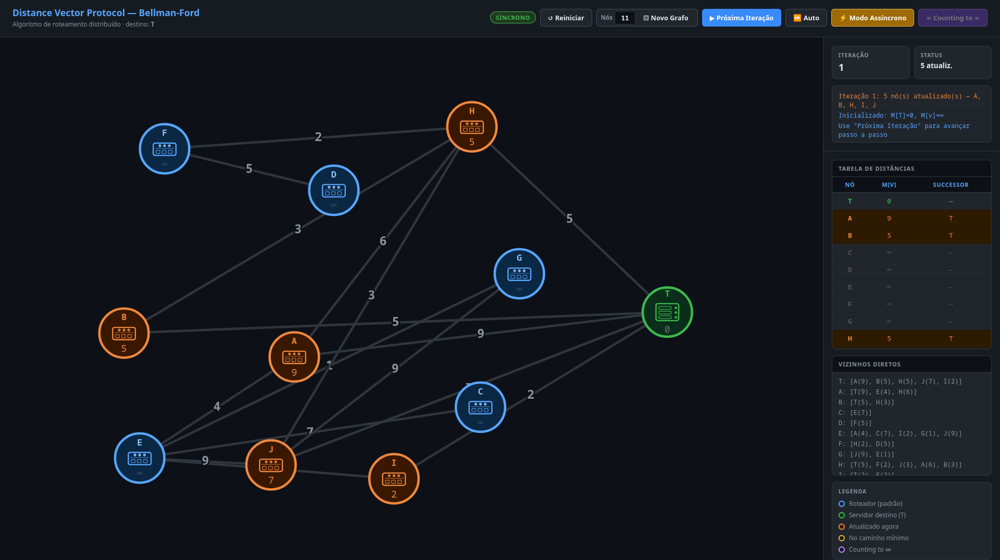
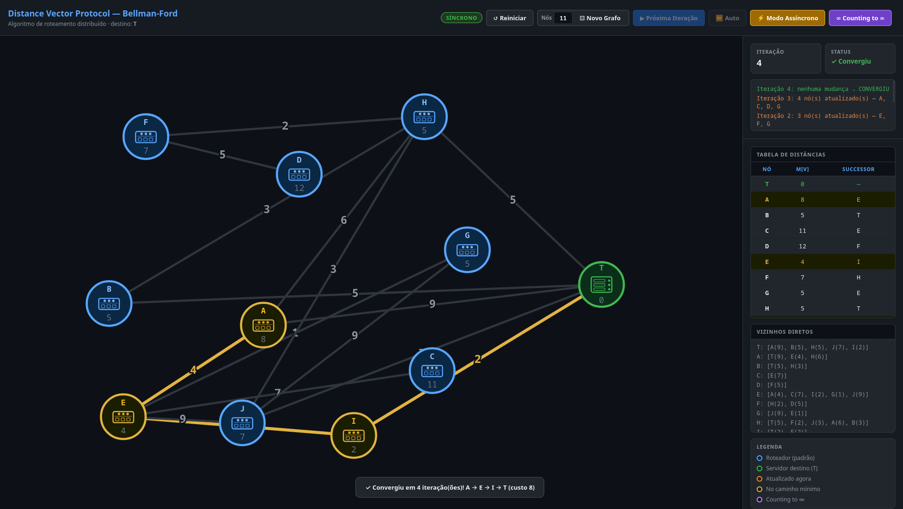
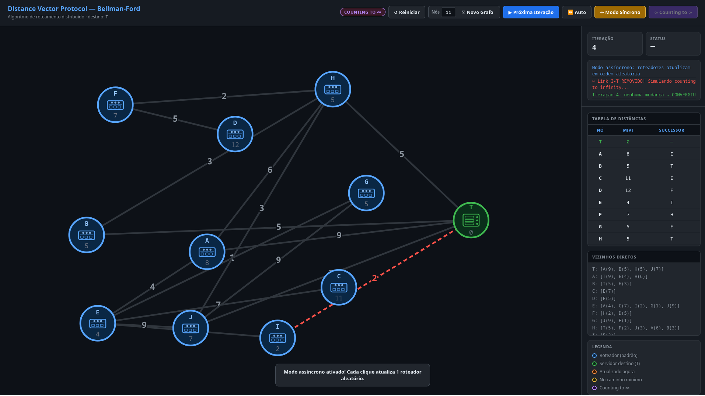
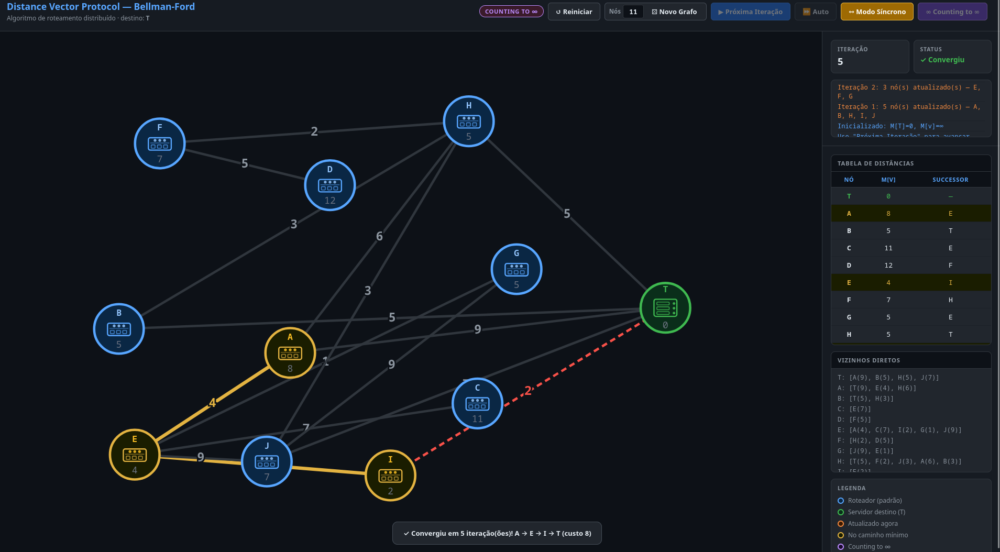

# Distance Vector Protocol — Bellman-Ford

Visualizador interativo do **algoritmo de Bellman-Ford** aplicado ao protocolo de roteamento por vetor de distâncias. Simula como roteadores de uma rede calculam o menor caminho até um destino **T** de forma distribuída, iteração por iteração.

---

## Alunos

<!-- Preencha com os dados do grupo -->

| Nome | Matrícula |
|------|-----------|
| Nome do Aluno 1 | XX/XXXXXXX |
| Nome do Aluno 2 | XX/XXXXXXX |

---

## Modos de Execução

| Modo | Descrição |
|------|-----------|
| **Síncrono** | Todos os roteadores atualizam suas tabelas ao mesmo tempo a cada iteração |
| **Assíncrono** | A cada passo, um roteador aleatório processa as mensagens recebidas |
| **Counting to ∞** | Simula a remoção de um enlace direto ao destino, expondo o problema de contagem ao infinito |

---

## Screenshots

### Tela Inicial

O grafo padrão com 8 nós (A–G + T) é carregado com todas as distâncias inicializadas em ∞, exceto M[T] = 0.

---

### Novo Grafo Gerado

A aplicação suporta grafos aleatórios de 4 a 11 nós, garantindo que o grafo seja sempre conexo.

---

### Iteração em Andamento

Nós em **laranja** tiveram sua distância atualizada na iteração atual. O painel lateral exibe a tabela de distâncias `M[v]` e os sucessores.

---

### Convergência (Modo Síncrono)

Após a convergência, o caminho mínimo de qualquer nó até **T** é destacado em **amarelo**. O toast inferior confirma o custo total e a rota encontrada.

---

### Counting to ∞

No modo **Counting to ∞**, um enlace direto ao destino é removido (tracejado vermelho). Os roteadores vizinhos começam a incrementar suas estimativas de distância indefinidamente.

---

### Convergência com Counting to ∞

Mesmo após a remoção do enlace, o algoritmo encontra um caminho alternativo e converge. O toast exibe a nova rota e custo.
